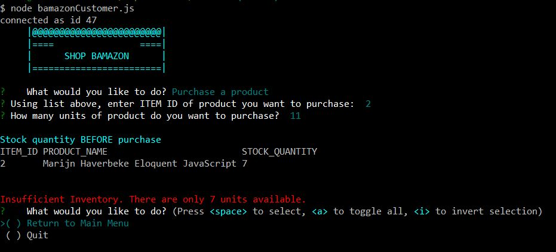

# bamazon
### CLI application using MySQL and Node.js


Click for demo [bamazon demo]() 

* displays a menu that allows the user to:
    * view all products available for sale
    * purchase products one at a time
    * quit the application
    
* data for this application is stored in a MySQL database: bamazon_DB, table: products
    * the database layout is stored in schema.sql
    * the database content is stored in seeds.sql
    * to create and populate the database you may:
        * use MySQL Workbench [MySQL Workbench](https://dev.mysql.com/downloads/workbench/)
            * cut and paste the contents of both the schema.sql and seeds.sql files into workbench, click the lightning bolt
        * OR use the command line: mysql -u root -p < schema.sql

* npm package Chalk was used to add color for improved readability in terminal
* npm package Columnify was used to align columns of data, also for improved readability

To run bamzon on your system follow these instructions.

**Environment Setup**
1. Navigate to the directory on your computer you wish to set up bamazon
2. Clone this bamazon repository into your directory
3. Still in that directory, from command line, type:
    * npm init -y // this will initialize a package.json file 
    * npm i dotenv // [more info](https://www.npmjs.com/package/dotenv) 
    * npm i mysql // [more info](https://www.npmjs.com/package/mysql) 
    * npm i inquirer // [more info](https://www.npmjs.com/package/inquirer) 
    * npm i columnify // [more info](https://www.npmjs.com/package/columnify)
    * npm i chalk // [more info](https://www.npmjs.com/package/chalk) 
    * if you do not have a file named ".env" create it and add the following to it:
        * the contents of the .env file should look like this:
           ```
            # My SQL password

            MYSQL_PW = enter YOUR MySQL password here
           ```
        Note: you must manually add YOUR MySQL password to file ".env" for bamazon to function

    * check to see if you have a .gitignore file (from command line type: ls -a) 
    * if you do not have a .gitignore file, create one and add these file names
        * node_modules
        * .DS_Store
        * .env
    * if you do have a .gitignore file, be sure it includes the 3 files listed above, if not, add them


**Run Application**    

1. From a command line, in same directory where required packages were installed, type:
    ```
    node bamazonCustomer.js
    ```
2. After pressing enter, the main menu is displayed with three options as shown below: 


3. Use the up-down arrow keys to navigate to the option you would like to run. Press the space bar to select the option, then press enter. Option 1 displays all the products available for purchase. After products are diplayed the user may choose to return to Main Menu or Quit the application.


4. Option 2 allows the user to purchase a product. When prompted: 
    * enter the item number of product to be purchased, press enter
    * enter the quantity of that product, press enter 


5. Results for that purchase are shown. Notice the change in stock quantity before and after purchase.
   Also notice the purchased product information: # of units, product name, cost per unit.
   The last line displays the Total Purchase amount.


6. If the quantity requested exceeds the quantity available, an error message will be displayed. 
   The user may then return to the main menu or quit the application.


7. The third and final option is to quit the application. This option will end node and the MySQL query connection.


